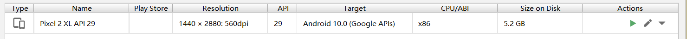
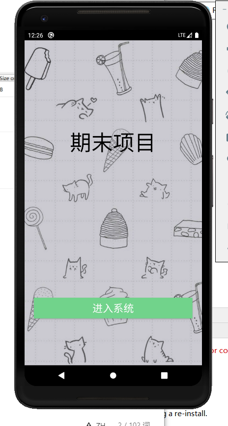
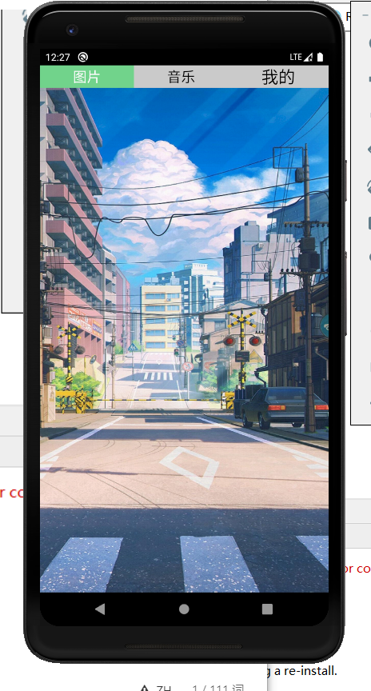
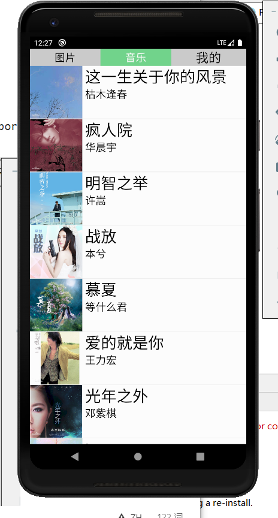
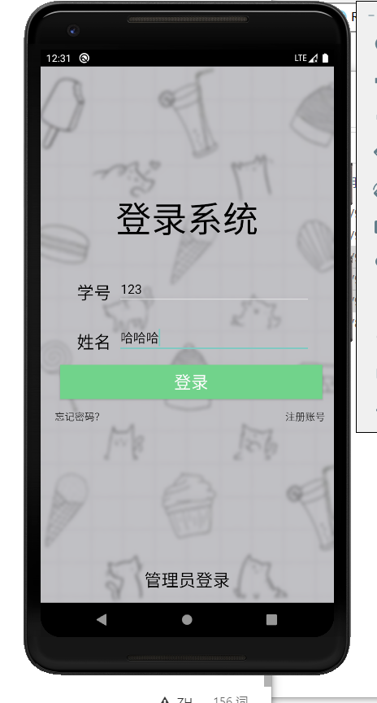
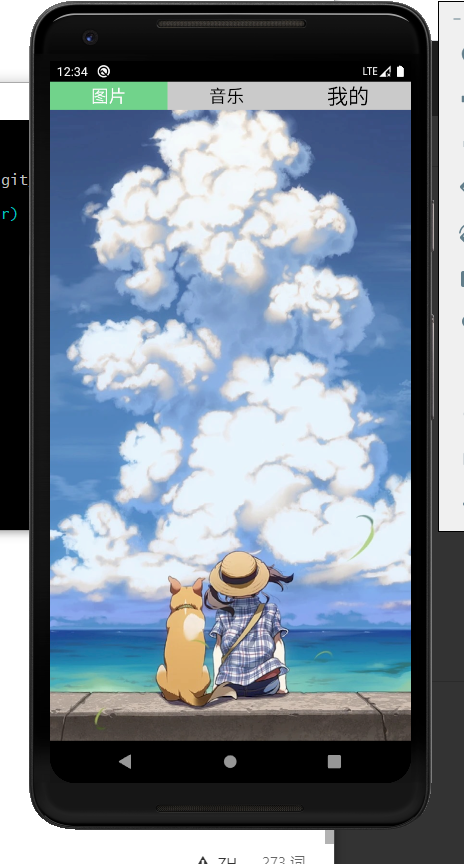
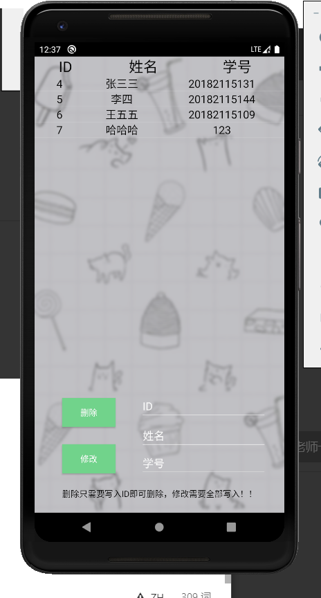

# 一个简单的APP项目制作

## 演示地址

https://www.bilibili.com/video/BV1eP4y1Y7JQ/

## 基本介绍

并不涉及网络连接等操作

## 软件版本

- Android studio 3.5.3
- JDK13
- sqlserver

### 模拟器

## 效果展示

## 功能

1. 登录功能，分为用户管理员登录
2. 忘记密码，用户注册
3. 图片查看
4. 音乐收听
5. 密码修改
6. 管理员对全部账户的管理

### 登录功能，忘记密码，用户注册，管理员登录

用户输入学号密码即可登录，管理员点击管理员登录输入账号密码即可登录。忘记密码注册功能大同小异，点击忘记密码和注册账号输入学号密码即可。

### 图片查看

登录后首页便是图片查看的内容，滑动可以查看其他图片。

### 音乐收听

点击音乐即可跳转界面。点击喜欢的音乐即可跳转播放。并附带有歌词。

### 管理账号管理

账号密码暂定为admin

